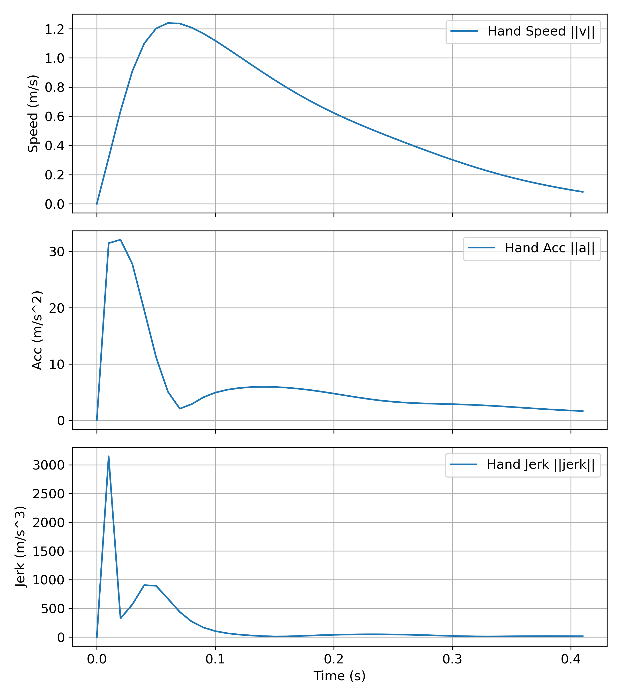
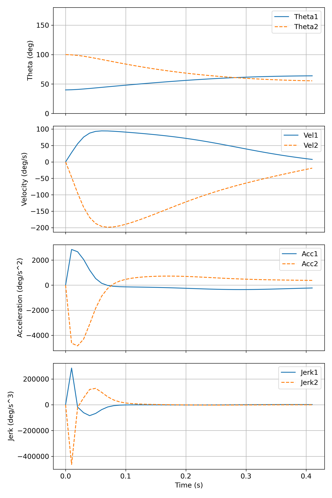

# Two-Link Arm Reacher（2リンク・リーチング）

## 概要

Two-Link Arm Reacher は、2 関節ロボットアームのリーチング動作を  
物理シミュレーションと強化学習（RL）で学習・可視化するプロジェクトです。

Python でカスタム実装した 2 リンクアーム環境上で目標位置への到達動作を学習させ、「ゴールできるか」だけでなく、人の到達運動に近い軌道を再現できているかを検証できるようにしています。

人の到達運動では一般に、

- 手先の軌道は目標に向かってほぼ直線的
- 速度プロファイルは運動時間の中盤に 1 つだけピークを持つベル型

といった特徴が知られています。

本プロジェクトでは、距離・時間・手先躍度（jerk）などを報酬として組み合わせることで、
報酬設計の違いによって軌道パターンがどのように変化するかを比較・可視化できるように構成しています。
学習ログの保存とプロット用スクリプトも含めており、  
学習アルゴリズムには Stable-Baselines3を用いつつ、

- 2 リンクアームの物理シミュレーション環境
- 報酬設計・エピソード管理
- 学習スクリプト、ログ保存・可視化

を自前で実装した、「物理シミュレーション + RL + ログ／可視化」を一連のワークフローとしてまとめた実験用リポジトリです。


---

## このリポジトリで実装していること

- 2リンクアームのダイナミクス（質量行列・コリオリ項・重力・減衰）を含むPython 製のカスタム物理シミュレーターを実装し、Gym 互換インターフェースを構築
- 関節トルクをアクションとする連続制御タスクとして定式化し、距離・時間・手先躍度などを分解した報酬設計とエピソード管理、ログ保存を実装
- Stable-Baselines3（SAC / PPO）を用いた学習スクリプトと軌道・速度プロファイル・報酬推移を可視化する Jupyter Notebook を作成
- 参考として、C 言語＋基底関数近似による 1 関節版（one_rink_reacher/）も実装

## 出力例

### 手先軌道＋アーム姿勢


学習済みポリシーで得られた手先軌道と、各時刻のアーム姿勢を重ねて表示した図です。  
目標位置への到達パターンと関節の動き方を一枚で確認できます。

---

### 手先ノルム（速度・加速度・躍度）



手先の速度・加速度・躍度（jerk）の時間変化をプロットした図です。  
リーチング中のピーク速度の位置や滑らかさを定量的に見ることができます。

---

### 関節ダイナミクス（角度・角速度・角加速度）



各関節の角度・角速度・角加速度・角躍度の時間推移をまとめた図です。  
手先レベルだけでなく、関節空間でどのように動いているかを確認できます。

---

### 報酬成分の推移


距離・時間・躍度ペナルティなど、報酬成分ごとにまとめた図です。  
学習が進むにつれて、どの項目がどのように変化しているかを把握できます。

---

## 機能・ポイント

- **ヒューマンライクなリーチングの検証**  
  手先軌道の直線性やベル型速度プロファイルがどの程度再現できているかを、  
  学習済みポリシーの軌道・速度ノルム・躍度などから評価できます。

- **報酬設計の比較実験**  
  距離・時間・手先躍度などの重みを変更し、  
  報酬設計の違いが軌道パターンや学習過程にどう影響するかを、ログとグラフで比較できます。

- **RL＋物理シミュのテンプレートとして利用可能**  
  2リンクアーム部分を差し替えることで、  
  他のロボットモデルや制御対象にも応用しやすい構成になっています（Gym 互換環境＋SB3ベース）。

- **解析用 Notebook 一式**  
  jerk_min.ipynb を実行するだけで、学習・評価・図の出力までを一通り再現でき、  
  「物理シミュ＋RL＋可視化」のワークフローをまとめて確認できます。

---

## 使用技術（推奨環境）
- Python 3.9 ～ 3.11 を推奨（3.12+ は依存で不整合が出る場合あり）  
- CPU 実行 
- ライブラリ例：PyTorch（CPU）、stable-baselines3、gymnasium、numpy、pandas、matplotlib など

---

## ディレクトリ構成
```
portfolio/
├── one_rink_reacher/              # C言語版（基底関数近似の実験）
│   ├── main.c
│   ├── function.c
│   └── param.h
├── two_rink_reacher/              # Python / SB3 実装（メイン）
│   ├── jerk_min.ipynb             # 学習・評価
│   ├── logs/                      # 学習・評価の出力（CSV・PNG・モデル等）
│   └── models/                    # 学習済みモデル（オプション）
└──-------------------             
```

---

## 実行方法（CPU 向け）
1. リポジトリをクローン
```bash
git clone https://github.com/rikunishida114/portfolio.git
cd portfolio
```

2. 仮想環境を作る（任意だが推奨）  
Linux / macOS:
```bash
python -m venv .venv
source .venv/bin/activate
```
Windows (PowerShell):
```powershell
python -m venv .venv
.venv\Scripts\Activate.ps1
```

3. まず CPU 用の PyTorch を入れる（推奨）
> PyTorch は環境によってバイナリが異なるため、先に CPU 用 wheel を指定してインストールするのがおすすめです。下は一例（OS/Python によりコマンドは変わるので、必要なら公式サイトの「Get Started」で生成されたコマンドを使ってください）。
```bash
pip install torch --index-url https://download.pytorch.org/whl/cpu
```

4. Stable-Baselines3（SB3） とその extras をインストール
```bash
pip install 'stable-baselines3[extra]'
# sb3-contrib を使っている場合は次も
pip install sb3-contrib
```
5. Jupyter を起動してノートブックを実行
```bash
jupyter notebook
# ブラウザで次を実行:
# jerk_min.ipynb   -> 学習、結果可視化
```

## 出力ファイル（`logs/` の説明）
`logs/` には学習中・評価時に生成した画像・CSV・モデル等を保存しています。主要なファイルと説明は次のとおりです（ファイル名は実行ごとに異なる場合があります）。

- `all_reward_components_overlay_ma_w10.png`  
  → 各報酬成分（距離改善・躍度・時間コスト・終端ペナルティ等）を **移動平均（window=10エピソード）** でオーバーレイ表示した図。報酬成分ごとの寄与推移を比較できます。

- `group_reward_components_ma_w10.png`  
  → 成分群（例：shaping 成分・terminal 成分）ごとにまとめた移動平均プロット。グループ間の振る舞いを俯瞰できます。

- `episode_jerk_sum_ma_w10.png`  
  → 各エピソードの累積手先躍度（jerk_sum）の移動平均（window=10）推移図。運動の滑らかさの変化を確認できます。

- `end_result_2joint_with_handnorms_trajectory_with_arms.png`  
  → 最終評価エピソードの手先軌道に加え、時刻ごとのアーム姿勢（関節を丸、リンクをやや太めの線で描画）を重ねた図。肩を原点とし、角度変化が視覚的に分かるようになっています。

- `end_result_2joint_with_handnorms_hand_norms.png`  
  → 最終エピソードにおける手先のノルム（速度 ||v||、加速度 ||a||、躍度 ||jerk||）の時間推移図。

- `end_result_2joint_with_handnorms_joint_dynamics.png`  
  → 各関節（joint1, joint2）の角度（deg）、角速度（deg/s）、角加速度、角躍度の時間推移をまとめた図。

---

## 補足：C言語バージョン
one_rink_reacher/ ディレクトリに含まれる C 言語版では、強化学習の方策を複数の基底関数を用いて近似しています。C言語が扱えることの証明として成果物に含めています。

使用ファイル：

main.c：エントリーポイント

function.c：報酬・行動選択・学習更新などの関数定義

param.h：ハイパーパラメータの定義

全ファイルを同一ディレクトリに配置すればコンパイル・実行が可能です。

※現在のバージョンではハイパーパラメータ調整が課題となり、十分な性能は出ていません。これを解決するために、深層強化学習を採用したバージョンを新たに作成しました。

